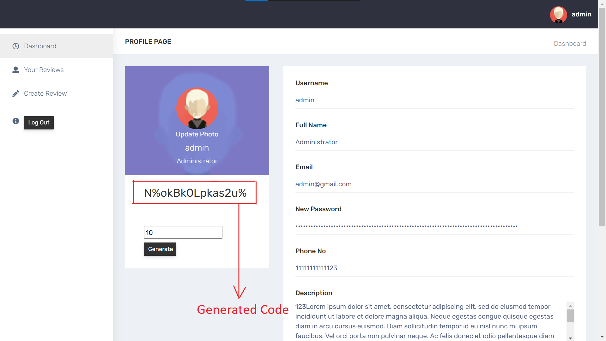
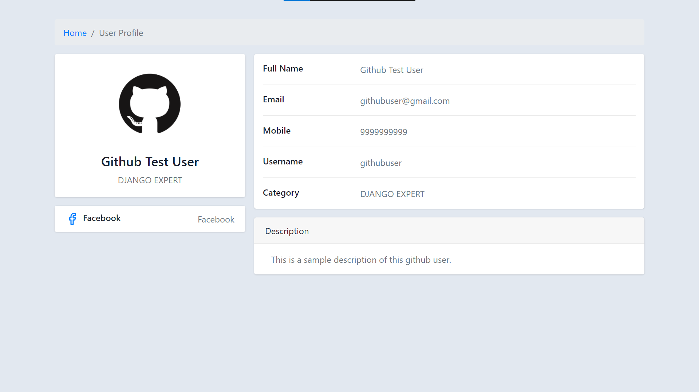
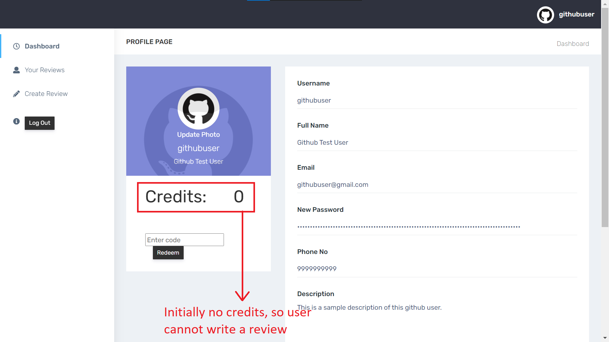
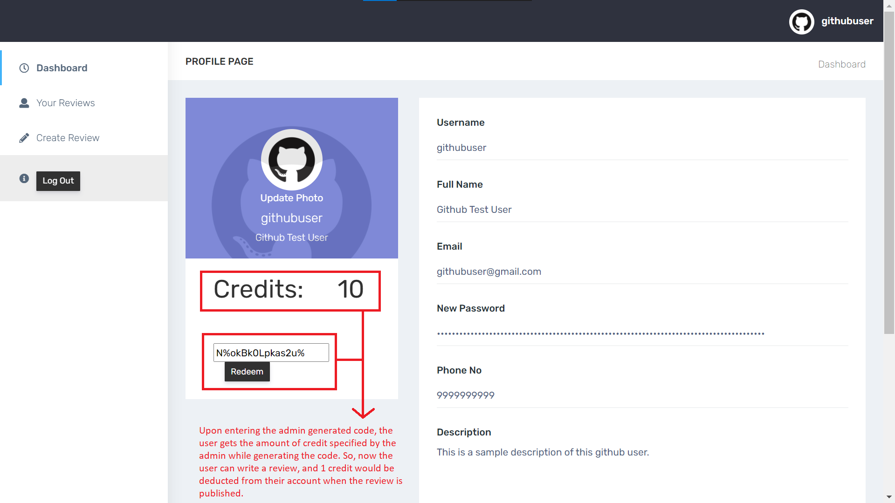
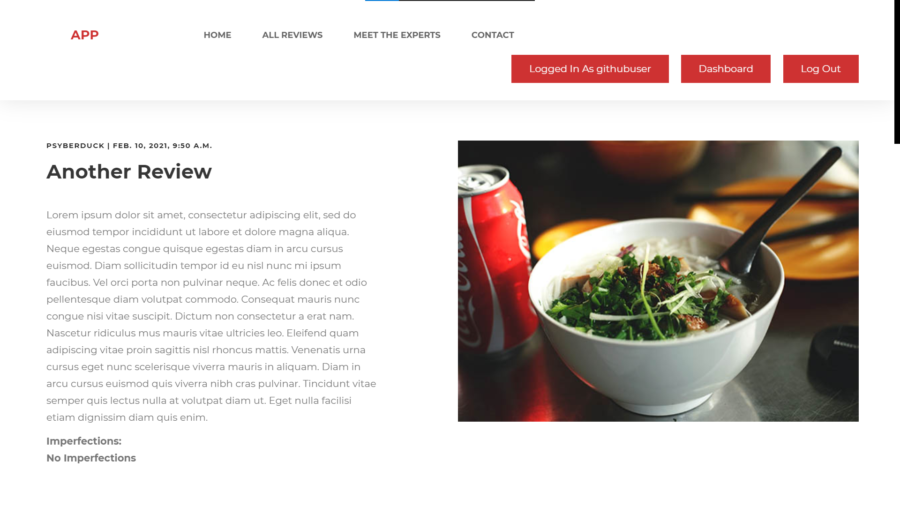

# <a href="http://rishavm7.pythonanywhere.com/">NewsApplication</a>

- This django application, allows the users to login and write review blogs.
- However, first the users need to be authorized by the admin, and then the admin would grant the users with certain credit points.
- Upon writing a review, 1 credit would be deducted from the user's available credits. A user will not be able to write a review, if he/she does not have any credits added to their account.

## Snapshots of the created application, are attached below.

 

 

 

 

